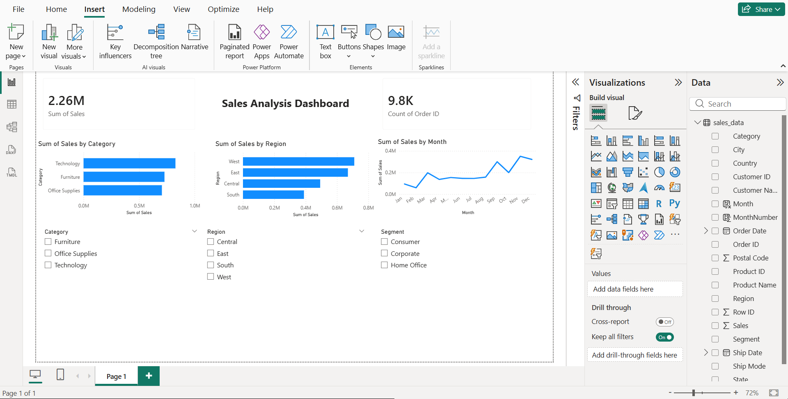

# &#x20;Sales Data Analysis & Dashboard

## Overview

This project analyzes sales data and presents insights through an interactive Power BI dashboard.

## Tools Used

* Python (Pandas, Matplotlib)
* Jupyter Notebook
* Power BI

## Key Insights

* Region-wise sales performance
* Category-wise comparison
* Monthly sales trends
* Customer segmentation analysis

## Features

* Interactive filters (Region, Category, Segment)
* KPI cards for total sales and order count
* Dynamic visualizations

## Dashboard Preview

*Interactive dashboard built using Power BI showing sales trends, category performance, and regional analysis.*

## Conclusion

This dashboard helps businesses understand sales patterns and supports data-driven decision-making.
